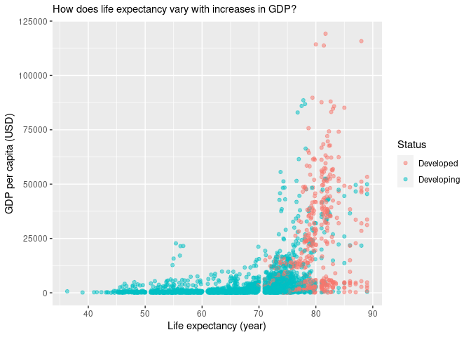
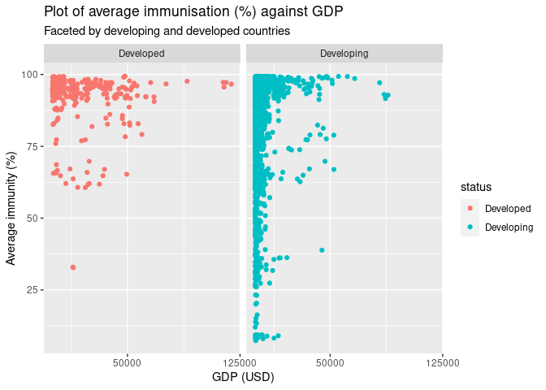
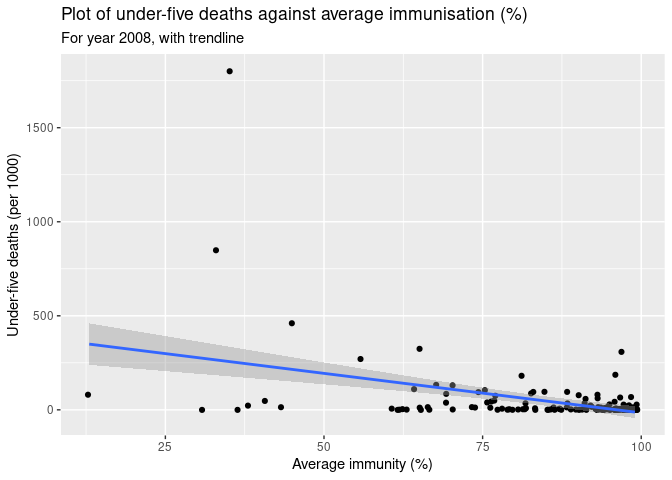

An investigation of the standard of living between developed and
developing countries.
================
Group172:
- Christopher Shen
- George Boutselis
- Ursula Doyle
- Osian ap Sion

## Summary

The goal of our research was to investigate the differences in standard
of living between developed and developing countries. Measures of
standard of living used include GDP, life expectancy, schooling, disease
and immunisation rates. We established correlations between these
variables through visualisations, summary statistics and some modelling.
Data used is from the World Health Organisation (WHO). Explanatory
questions are asked and answered through these methods.

We discovered that there was not a strong linear correlation between GDP
and life expectancy. However, most developed countries have a higher GDP
per capita and life expectancy than developing countries, as shown below
in figure 1. Therefore, in order to find a better model, we decided to
split our data into testing and training sets. We created a model for
all predictor variables (excluding country name) and modelled their
relationship with life expectancy. This model has a strong linear
correlation.

**Figure 1**: Plot of GDP (USD) against life expectancy (year)
<!-- -->

We also investigated the relationships between GDP, immunisation rate
and under 5 deaths. Exploratory questions include: Do developed
countries have higher immunisation rates? Does higher average
immunisation rates result in lower under 5 deaths? In summary, the
answer is yes for both questions. Developed countries have on average
higher immunisation rates, in fact, about 10% higher. This is also
supported by visualisations, as shown in figure 2. Please note that the
immunisation rate variable used here is a new variable created from an
average of various specific vaccination rate statistics.

**Figure 2**: Plot of average immunisation (%) against GDP (USD)
<!-- -->

The relationship between immunisation rates and under 5 deaths is first
investigated by plotting the average immunisation against under 5
deaths. In this first plot, outliers in the data and a high density of
points in the bottom of the plot became apparent, even with the use of
the jitter function in ggplot, necessitating further investigation.
Faceting by year, it was apparent that the data was cleaner in the year
2008, resulting in the final two plots, showing a clearer correlation.
This is shown in figure 3. Unfortunately, choosing the year 2008 limited
the amount of data available from countries with low average immunity,
implying a more thorough investigation is needed using more data from
these countries. In conclusion, we can tentatively say that higher
average immunisation is correlated with lower under 5 deaths.

**Figure 3**: Plot of under-five deaths against average immunisation (%)
<!-- -->

Countries that had higher HIV/AIDS related deaths were quickly
identified and we found that these high observations were predominantly
in developing countries which also happened to be in Africa. When we
compared countries and years spent in school, it was found that the same
countries with high HIV/AIDS deaths had on average, little years spent
at school. We then plotted 3 line graphs of percentage vaccinated of
hepatitis b, polio and diphtheria vs number of years spent at school and
found that there was a strong linear relationship between these 2
variables although there were some outliers. We then found the mean
worldwide average for HIV/AIDS related deaths and measles related deaths
and compared them to all the countries individually. It was found that
100% of developed countries had less HIV deaths than the world average
and 96% of developed countries had less measles related deaths than the
world average. This is probably as there are outliers where these
diseases are epidemics such as HIV in African countries but it is
evident that developing countries have a greater prevalence of diseases.

In conclusion we have looked at various variables that measure living
standards and life expectancy. From our limited scope of investigation,
we are able to conclude that there is a marked improvement of living
standards of all aspects when comparing the developed to the developing
world.

A very brief criticism would be that more models could be built for
various years/countries/variables. Slopes of these linear models can be
compared and used to further support or dismiss conclusion(s). There
also could be a focus on quality rather than quantity - statistical
outliers in visualisations can be investigated in depth, and
presentation layout can be improved.

Word count: 685

``` r
glimpse(life_expectancy)
```

    ## Rows: 2,739
    ## Columns: 20
    ## $ country                <chr> "Afghanistan", "Afghanistan", "Afghanistan", "A…
    ## $ year                   <dbl> 2015, 2014, 2013, 2012, 2011, 2010, 2009, 2008,…
    ## $ status                 <chr> "Developing", "Developing", "Developing", "Deve…
    ## $ life_expectancy        <dbl> 65.0, 59.9, 59.9, 59.5, 59.2, 58.8, 58.6, 58.1,…
    ## $ adult_mortality        <dbl> 263, 271, 268, 272, 275, 279, 281, 287, 295, 29…
    ## $ infant_deaths          <dbl> 62, 64, 66, 69, 71, 74, 77, 80, 82, 84, 85, 87,…
    ## $ alcohol                <dbl> 0.01, 0.01, 0.01, 0.01, 0.01, 0.01, 0.01, 0.03,…
    ## $ percentage_expenditure <dbl> 71.279624, 73.523582, 73.219243, 78.184215, 7.0…
    ## $ hepatitis_b            <dbl> 65, 62, 64, 67, 68, 66, 63, 64, 63, 64, 66, 67,…
    ## $ measles                <dbl> 1154, 492, 430, 2787, 3013, 1989, 2861, 1599, 1…
    ## $ bmi                    <dbl> 19.1, 18.6, 18.1, 17.6, 17.2, 16.7, 16.2, 15.7,…
    ## $ under_five_deaths      <dbl> 83, 86, 89, 93, 97, 102, 106, 110, 113, 116, 11…
    ## $ polio                  <dbl> 6, 58, 62, 67, 68, 66, 63, 64, 63, 58, 58, 5, 4…
    ## $ total_expenditure      <dbl> 8.16, 8.18, 8.13, 8.52, 7.87, 9.20, 9.42, 8.33,…
    ## $ diphtheria             <dbl> 65, 62, 64, 67, 68, 66, 63, 64, 63, 58, 58, 5, …
    ## $ hiv_aids               <dbl> 0.1, 0.1, 0.1, 0.1, 0.1, 0.1, 0.1, 0.1, 0.1, 0.…
    ## $ gdp                    <dbl> 584.25921, 612.69651, 631.74498, 669.95900, 63.…
    ## $ population             <dbl> 33736494, 327582, 31731688, 3696958, 2978599, 2…
    ## $ thinness_1_19_years    <dbl> 17.2, 17.5, 17.7, 17.9, 18.2, 18.4, 18.6, 18.8,…
    ## $ schooling              <dbl> 10.1, 10.0, 9.9, 9.8, 9.5, 9.2, 8.9, 8.7, 8.4, …

## Presentation

Our presentation.rmd can be found
[here](https://github.com/quadruple-integral/ids-21-project-group172/tree/main/presentation).

Our presentation video can be found
[here](https://media.ed.ac.uk/media/Group172+-+Final+Project/1_zb9znl7k).

## Data

Life expectancy data:

-   World Health Organization (WHO)

-   Published on Kaggle

-   From 2000 to 2015

-   Statistical analysis on factors influencing life expectancy

-   Date viewed: 22/10/2021

## References

-   <https://www.kaggle.com/kumarajarshi/life-expectancy-who/version/1>
