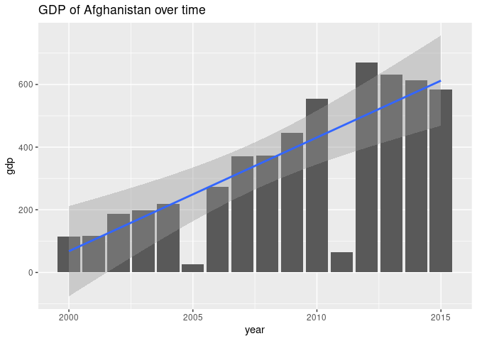
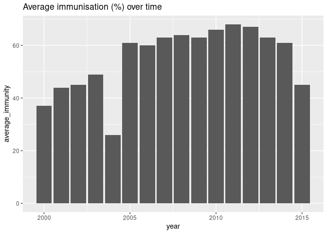
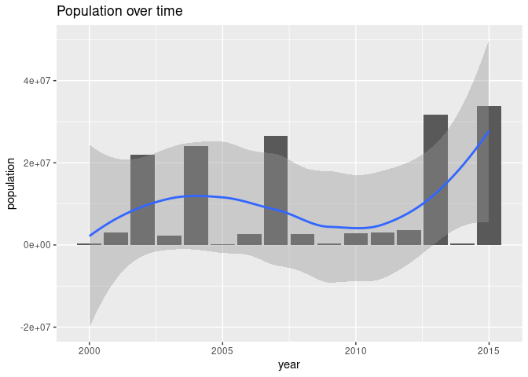
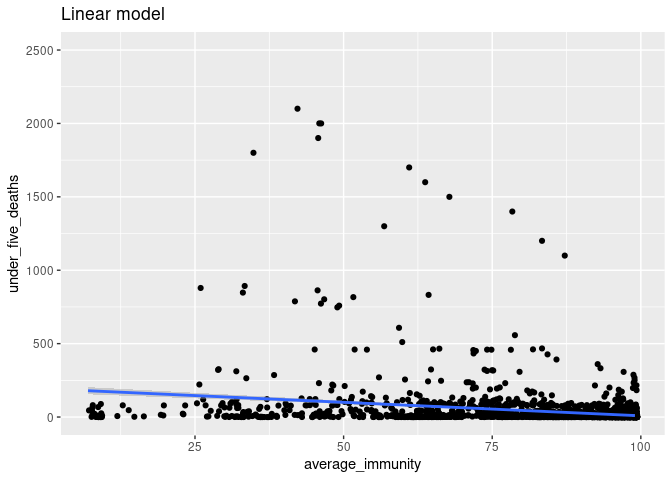
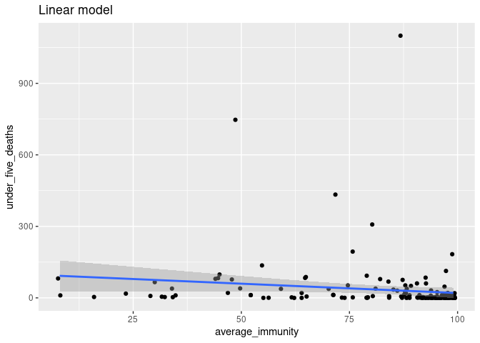
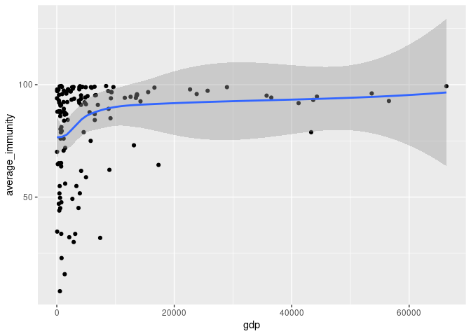
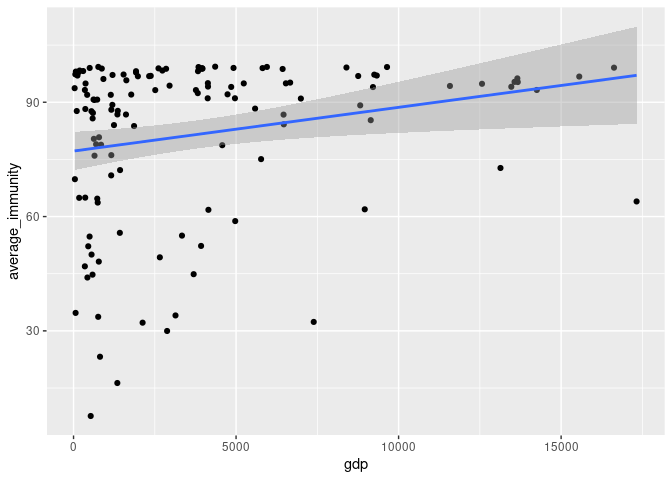
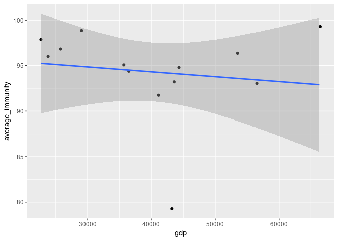

```r
library(tidyverse)
library(janitor)
library(here)
library(parsnip)
```

## Data


```r
life_expectancy <- read_csv(here("data/Life Expectancy Data.csv")) %>%
  clean_names()
```


```r
immune <- life_expectancy %>%
  select(country, year, status, gdp, population, under_five_deaths, hepatitis_b, polio, diphtheria) %>%
  mutate(average_immunity = (hepatitis_b + polio + diphtheria) / 3) %>%
  mutate(average_immunity = round(average_immunity, digits = 0)) %>%
  select(country, status, year, gdp, population, under_five_deaths, average_immunity)

immune
```

```
## # A tibble: 2,739 × 7
##    country     status    year   gdp population under_five_deat… average_immunity
##    <chr>       <chr>    <dbl> <dbl>      <dbl>            <dbl>            <dbl>
##  1 Afghanistan Develop…  2015 584.    33736494               83               45
##  2 Afghanistan Develop…  2014 613.      327582               86               61
##  3 Afghanistan Develop…  2013 632.    31731688               89               63
##  4 Afghanistan Develop…  2012 670.     3696958               93               67
##  5 Afghanistan Develop…  2011  63.5    2978599               97               68
##  6 Afghanistan Develop…  2010 553.     2883167              102               66
##  7 Afghanistan Develop…  2009 446.      284331              106               63
##  8 Afghanistan Develop…  2008 373.     2729431              110               64
##  9 Afghanistan Develop…  2007 370.    26616792              113               63
## 10 Afghanistan Develop…  2006 273.     2589345              116               60
## # … with 2,729 more rows
```

## Visualisations

### A developing country: Afghanistan


```r
immune_afg <- immune %>%
  select(country, year, gdp, population, under_five_deaths, average_immunity) %>%
  filter(country == "Afghanistan")
```

#### Plot 1: GDP over time


```r
immune_afg %>%
  ggplot(aes(x = year, y = gdp)) +
  geom_col() +
  geom_smooth(method = "lm") +
  labs(title = "GDP of Afghanistan over time")
```

```
## `geom_smooth()` using formula 'y ~ x'
```

<!-- -->


```r
afg_gdp_fit <- linear_reg() %>%
  set_engine("lm") %>%
  fit(gdp ~ year, data = immune_afg)

tidy(afg_gdp_fit)
```

```
## # A tibble: 2 × 5
##   term        estimate std.error statistic  p.value
##   <chr>          <dbl>     <dbl>     <dbl>    <dbl>
## 1 (Intercept) -72525.   15311.       -4.74 0.000318
## 2 year            36.3      7.63      4.76 0.000305
```

#### Plot 2: Average immunisation over time


```r
immune_afg %>%
  ggplot(aes(x = year, y = average_immunity)) +
  geom_col() +
  labs(title = "Average immunisation (%) over time")
```

<!-- -->

#### Plot 3: Population over time


```r
immune_afg %>%
  ggplot(aes(x = year, y = population)) +
  geom_col() +
  geom_smooth(method = "loess") +
  labs(title = "Population over time")
```

```
## `geom_smooth()` using formula 'y ~ x'
```

<!-- -->

## Modelling 1 - Average immunisation (%) effect on under 5 deaths (per 1000)

#### Visualisations of under 5 deaths against average immunisation


```r
av_immune <- immune %>%
  select(average_immunity, under_five_deaths)

av_immune %>%
  ggplot(aes(x = average_immunity, y = under_five_deaths)) +
  geom_jitter() +
  geom_smooth(method = "lm") + 
  labs(title = "Linear model")
```

```
## `geom_smooth()` using formula 'y ~ x'
```

```
## Warning: Removed 525 rows containing non-finite values (stat_smooth).
```

```
## Warning: Removed 525 rows containing missing values (geom_point).
```

<!-- -->

There is too much noise - let's do this for a specific year.

#### Visualisation & model for year 2015


```r
immune_2015 <- immune %>%
  filter(year == 2015) %>%
  select(average_immunity, under_five_deaths)
```


```r
immune_2015 %>%
  ggplot(aes(x = average_immunity, y = under_five_deaths)) +
  geom_jitter() +
  geom_smooth(method = "lm") + 
  labs(title = "Linear model")
```

```
## `geom_smooth()` using formula 'y ~ x'
```

```
## Warning: Removed 8 rows containing non-finite values (stat_smooth).
```

```
## Warning: Removed 8 rows containing missing values (geom_point).
```

<!-- -->

```r
immune_2015_fit <- linear_reg() %>%
  set_engine("lm") %>%
  fit(under_five_deaths ~ average_immunity, data = immune_2015)

tidy(immune_2015_fit)
```

```
## # A tibble: 2 × 5
##   term             estimate std.error statistic p.value
##   <chr>               <dbl>     <dbl>     <dbl>   <dbl>
## 1 (Intercept)        98.6      36.0        2.74 0.00689
## 2 average_immunity   -0.784     0.420     -1.87 0.0638
```

## Modelling 2 - GDP effect on Average immunisation (%) for year 2015


```r
immune_gdp <- immune %>%
  filter(year == 2015) %>%
  select(gdp, average_immunity)
```


```r
immune_gdp %>%
  ggplot(aes(x = gdp, y = average_immunity)) +
  geom_jitter() +
  geom_smooth()
```

```
## `geom_smooth()` using method = 'loess' and formula 'y ~ x'
```

```
## Warning: Removed 31 rows containing non-finite values (stat_smooth).
```

```
## Warning: Removed 31 rows containing missing values (geom_point).
```

<!-- -->

Unclear what is happening - split into GDP intervals

#### GDP from 0 to 20000


```r
developing <- immune_gdp %>%
  filter(!gdp > 20000)
```


```r
developing %>%
  ggplot(aes(x = gdp, average_immunity)) +
  geom_jitter() +
  geom_smooth(method = "lm")
```

```
## `geom_smooth()` using formula 'y ~ x'
```

```
## Warning: Removed 7 rows containing non-finite values (stat_smooth).
```

```
## Warning: Removed 7 rows containing missing values (geom_point).
```

<!-- -->

#### GDP over 20000


```r
developing <- immune_gdp %>%
  filter(gdp > 20000)
```


```r
developing %>%
  ggplot(aes(x = gdp, average_immunity)) +
  geom_jitter() +
  geom_smooth(method = "lm")
```

```
## `geom_smooth()` using formula 'y ~ x'
```

```
## Warning: Removed 1 rows containing non-finite values (stat_smooth).
```

```
## Warning: Removed 1 rows containing missing values (geom_point).
```

<!-- -->
