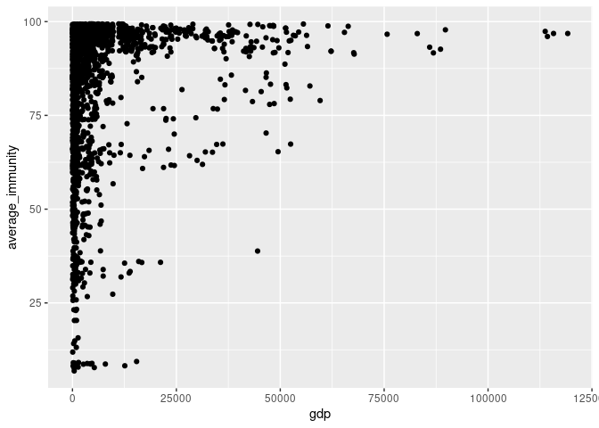
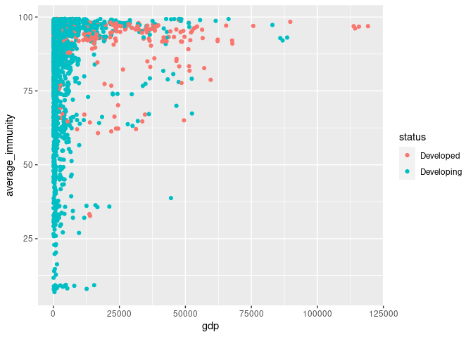
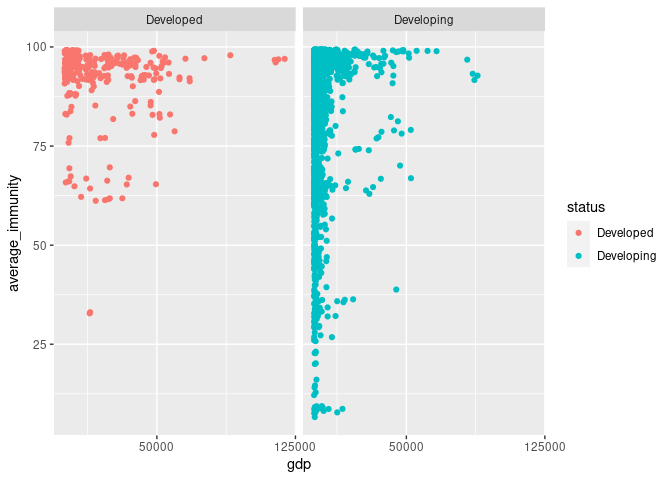
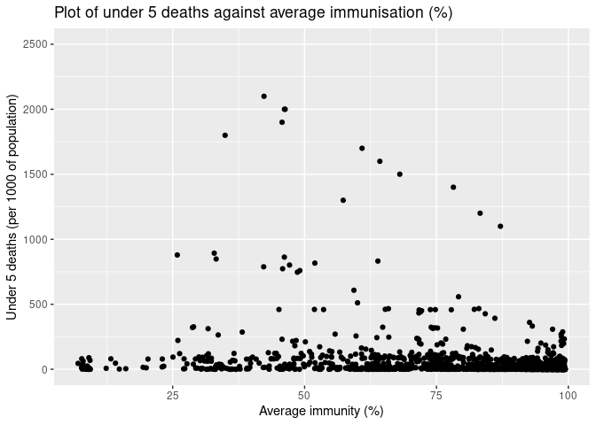
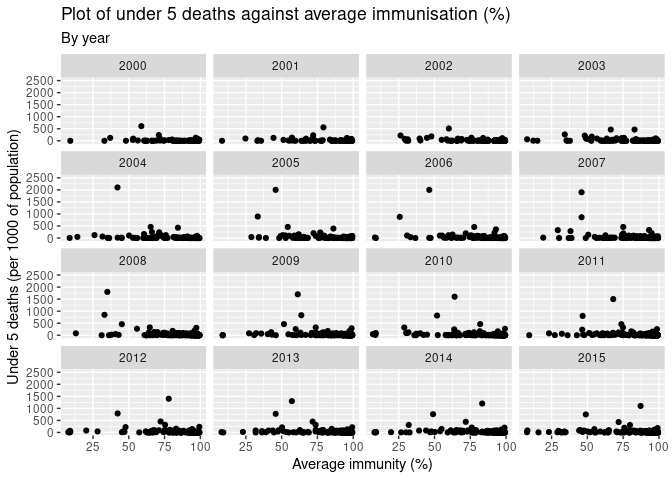
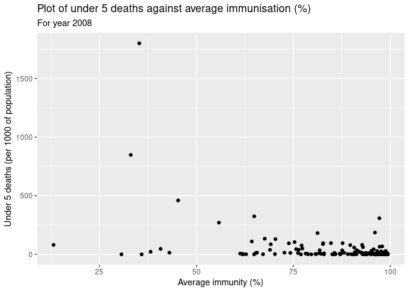
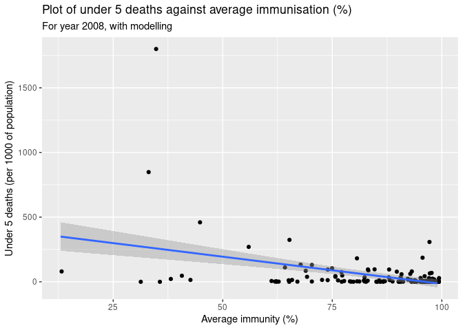

```r
library(tidyverse)
library(janitor)
library(here)
library(parsnip)
```

### Introduction

This part of the presentation focuses on studying two main topics:

- Effect of GDP (developing vs developed world) on immunisation rate

- Effect of immunisation against diseases (Hepatitis B, Polio & Diphtheria) on under 5 deaths

Data is wrangled then explored through visualisations and summary statistics, followed by some modelling from which conclusions are drawn.

#### Variables

Predictor variables: 

- Average immunisation against disease

- GDP

- Status of country

Outcome variables: 

- Under 5 deaths

#### Hypotheses

- An increase in GDP results in higher immunisation rates

- Developed countries tend to have higher immunisation rates

- An increase immunisation rates results in reduced deaths

### Data

Read data and changed variable names to snake_case using the `clean_names()` function from the `janitor` package.

```r
life_expectancy <- read_csv(here("data/Life Expectancy Data.csv")) %>%
  clean_names()
```

```
## Rows: 2739 Columns: 22
```

```
## ── Column specification ────────────────────────────────────────────────────────
## Delimiter: ","
## chr  (2): Country, Status
## dbl (20): Year, Life expectancy, Adult Mortality, infant deaths, Alcohol, pe...
```

```
## 
## ℹ Use `spec()` to retrieve the full column specification for this data.
## ℹ Specify the column types or set `show_col_types = FALSE` to quiet this message.
```

Created new variable `average_immunity` by taking the average of the three variables `hepatitis_b`, `polio`, `diphtheria`. Saved this as new data frame named `immune`.

```r
immune <- life_expectancy %>%
  select(country, year, status, gdp, population, under_five_deaths, hepatitis_b, polio, diphtheria) %>%
  mutate(average_immunity = (hepatitis_b + polio + diphtheria) / 3) %>%
  mutate(average_immunity = round(average_immunity, digits = 0)) %>%
  select(country, status, year, gdp, population, under_five_deaths, average_immunity)

immune
```

```
## # A tibble: 2,739 × 7
##    country     status    year   gdp population under_five_deat… average_immunity
##    <chr>       <chr>    <dbl> <dbl>      <dbl>            <dbl>            <dbl>
##  1 Afghanistan Develop…  2015 584.    33736494               83               45
##  2 Afghanistan Develop…  2014 613.      327582               86               61
##  3 Afghanistan Develop…  2013 632.    31731688               89               63
##  4 Afghanistan Develop…  2012 670.     3696958               93               67
##  5 Afghanistan Develop…  2011  63.5    2978599               97               68
##  6 Afghanistan Develop…  2010 553.     2883167              102               66
##  7 Afghanistan Develop…  2009 446.      284331              106               63
##  8 Afghanistan Develop…  2008 373.     2729431              110               64
##  9 Afghanistan Develop…  2007 370.    26616792              113               63
## 10 Afghanistan Develop…  2006 273.     2589345              116               60
## # … with 2,729 more rows
```

### Visualisations: GDP & average immunisation

#### Plot of average immunisation (%) against GDP


```r
immune %>%
  ggplot(aes(x = gdp, y = average_immunity)) +
  geom_jitter()
```

```
## Warning: Removed 821 rows containing missing values (geom_point).
```

<!-- -->

#### Grouped by developed & developing status


```r
immune %>%
  group_by(status) %>%
  ggplot(aes(x = gdp, y = average_immunity, colour = status)) +
  geom_jitter()
```

```
## Warning: Removed 821 rows containing missing values (geom_point).
```

<!-- -->

#### Facet


```r
immune %>%
  group_by(status) %>%
  ggplot(aes(x = gdp, y = average_immunity, colour = status)) +
  geom_jitter() +
  facet_wrap(. ~ status) +
  scale_x_continuous(breaks = c(50000, 125000))
```

```
## Warning: Removed 821 rows containing missing values (geom_point).
```

<!-- -->

#### Statistics


```r
immune %>%
  group_by(status) %>%
  filter(!is.na(gdp), !is.na(average_immunity)) %>%
  summarise(mean(gdp), min(average_immunity), mean(average_immunity), max(average_immunity))
```

```
## # A tibble: 2 × 5
##   status     `mean(gdp)` `min(average_immu… `mean(average_imm… `max(average_imm…
##   <chr>            <dbl>              <dbl>              <dbl>             <dbl>
## 1 Developed       19383.                 33               91.7                99
## 2 Developing       4531.                  7               82.0                99
```


### Visualisations: Average immunisation & under 5 deaths

#### Plot of under 5 deaths against average immunisation (%)


```r
av_immune <- immune %>%
  select(year, average_immunity, under_five_deaths)
```

This plot I cannot tell head or tails.

```r
av_immune %>%
  ggplot(aes(x = average_immunity, y = under_five_deaths)) +
  geom_jitter() +
  labs(title = "Plot of under 5 deaths against average immunisation (%)",
       x = "Average immunity (%)",
       y = "Under 5 deaths (per 1000 of population)")
```

```
## Warning: Removed 525 rows containing missing values (geom_point).
```

<!-- -->

So I faceted the plot by year and the message is much clearer.

```r
av_immune %>%
  group_by(year) %>%
  ggplot(aes(x = average_immunity, y = under_five_deaths)) +
  geom_jitter() +
  facet_wrap(. ~ year) +
  labs(title = "Plot of under 5 deaths against average immunisation (%)",
       subtitle = "By year",
       x = "Average immunity (%)",
       y = "Under 5 deaths (per 1000 of population)")
```

```
## Warning: Removed 525 rows containing missing values (geom_point).
```

<!-- -->

#### Plot of under 5 deaths against average immunisation (%) for year 2008

This year is selected as it works best with the available tool set, namely linear regression.

```r
av_immune <- av_immune %>%
  filter(year == 2008)
```


```r
av_immune %>%
  ggplot(aes(x = average_immunity, y = under_five_deaths)) +
  geom_jitter() +
  labs(title = "Plot of under 5 deaths against average immunisation (%)",
       subtitle = "For year 2008",
       x = "Average immunity (%)",
       y = "Under 5 deaths (per 1000 of population)")
```

```
## Warning: Removed 19 rows containing missing values (geom_point).
```

<!-- -->

### Modelling


```r
av_immune %>%
  ggplot(aes(x = average_immunity, y = under_five_deaths)) +
  geom_jitter() +
  geom_smooth(method = "lm") +
  labs(title = "Plot of under 5 deaths against average immunisation (%)",
       subtitle = "For year 2008, with modelling",
       x = "Average immunity (%)",
       y = "Under 5 deaths (per 1000 of population)")
```

```
## `geom_smooth()` using formula 'y ~ x'
```

```
## Warning: Removed 19 rows containing non-finite values (stat_smooth).
```

```
## Warning: Removed 19 rows containing missing values (geom_point).
```

<!-- -->


```r
av_immune_fit <- linear_reg() %>%
  set_engine("lm") %>%
  fit(under_five_deaths ~ average_immunity, data = av_immune)

tidy(av_immune_fit)
```

```
## # A tibble: 2 × 5
##   term             estimate std.error statistic       p.value
##   <chr>               <dbl>     <dbl>     <dbl>         <dbl>
## 1 (Intercept)        404.      65.4        6.18 0.00000000583
## 2 average_immunity    -4.20     0.752     -5.59 0.000000104
```

### Conclusion

Confirm hypothesis
