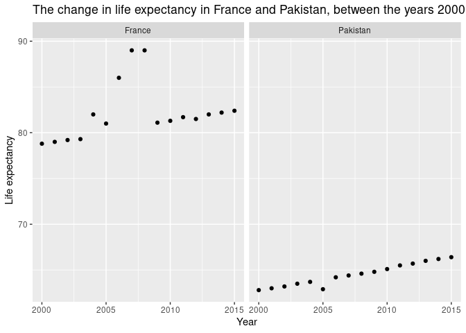
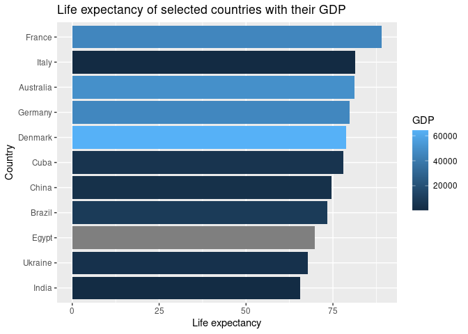
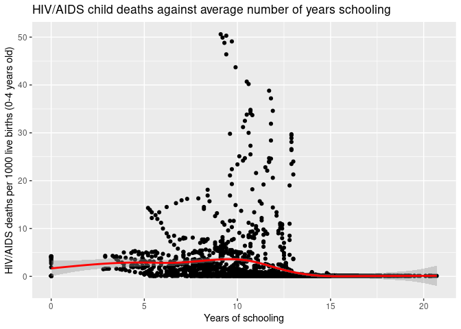

Project proposal
================
Group172

``` r
library(tidyverse)
library(broom)
library(here)
```

## 1. Introduction

Our group proposes a data analysis on the differences of living
standards between developed and developing countries.

#### Questions to explore:

How does life expectancy vary between developing and developed countries

To what extent is there a correlation between factors affecting quality
of life (standard of living?) and life expectancy?

#### Topics to explore:

How does population growth vary between developed and developing
countries?

Relationship between time spent in education and prevalence of disease
(e.g. HIV/AIDS).

Relationship between expenditure on health and prevalence of diseases
(e.g. measles), life expectancy, infant mortality, population etc.

#### Cases

The cases for the dataset are observations of data collected for a
country in a specific year.

#### How was the data collected

The Global health Observatory keeps track of the health status as well
as many other related factors for all countries. Life expectancy, health
factors have been collected from the WHO data repository and the
corresponding economic data was collected from the United Nation
website.

#### Variables affecting quality of life

1.  Quality of education
2.  Prevalence of disease

## 2. Data

``` r
library(tidyverse)

Life_Expectancy_Data <- read_csv(here("data/Life Expectancy Data.csv"))
```

    ## Rows: 2739 Columns: 22

    ## ── Column specification ────────────────────────────────────────────────────────
    ## Delimiter: ","
    ## chr  (2): Country, Status
    ## dbl (20): Year, Life expectancy, Adult Mortality, infant deaths, Alcohol, pe...

    ## 
    ## ℹ Use `spec()` to retrieve the full column specification for this data.
    ## ℹ Specify the column types or set `show_col_types = FALSE` to quiet this message.

``` r
Life_Expectancy_Data <- Life_Expectancy_Data %>%
  select(!contains("thinness 5-9 years") & !contains("income composition of resources"))

glimpse(Life_Expectancy_Data)
```

    ## Rows: 2,739
    ## Columns: 20
    ## $ Country                  <chr> "Afghanistan", "Afghanistan", "Afghanistan", …
    ## $ Year                     <dbl> 2015, 2014, 2013, 2012, 2011, 2010, 2009, 200…
    ## $ Status                   <chr> "Developing", "Developing", "Developing", "De…
    ## $ `Life expectancy`        <dbl> 65.0, 59.9, 59.9, 59.5, 59.2, 58.8, 58.6, 58.…
    ## $ `Adult Mortality`        <dbl> 263, 271, 268, 272, 275, 279, 281, 287, 295, …
    ## $ `infant deaths`          <dbl> 62, 64, 66, 69, 71, 74, 77, 80, 82, 84, 85, 8…
    ## $ Alcohol                  <dbl> 0.01, 0.01, 0.01, 0.01, 0.01, 0.01, 0.01, 0.0…
    ## $ `percentage expenditure` <dbl> 71.279624, 73.523582, 73.219243, 78.184215, 7…
    ## $ `Hepatitis B`            <dbl> 65, 62, 64, 67, 68, 66, 63, 64, 63, 64, 66, 6…
    ## $ Measles                  <dbl> 1154, 492, 430, 2787, 3013, 1989, 2861, 1599,…
    ## $ BMI                      <dbl> 19.1, 18.6, 18.1, 17.6, 17.2, 16.7, 16.2, 15.…
    ## $ `under-five deaths`      <dbl> 83, 86, 89, 93, 97, 102, 106, 110, 113, 116, …
    ## $ Polio                    <dbl> 6, 58, 62, 67, 68, 66, 63, 64, 63, 58, 58, 5,…
    ## $ `Total expenditure`      <dbl> 8.16, 8.18, 8.13, 8.52, 7.87, 9.20, 9.42, 8.3…
    ## $ Diphtheria               <dbl> 65, 62, 64, 67, 68, 66, 63, 64, 63, 58, 58, 5…
    ## $ `HIV/AIDS`               <dbl> 0.1, 0.1, 0.1, 0.1, 0.1, 0.1, 0.1, 0.1, 0.1, …
    ## $ GDP                      <dbl> 584.25921, 612.69651, 631.74498, 669.95900, 6…
    ## $ Population               <dbl> 33736494, 327582, 31731688, 3696958, 2978599,…
    ## $ `thinness  1-19 years`   <dbl> 17.2, 17.5, 17.7, 17.9, 18.2, 18.4, 18.6, 18.…
    ## $ Schooling                <dbl> 10.1, 10.0, 9.9, 9.8, 9.5, 9.2, 8.9, 8.7, 8.4…

## 3. Data analysis plan

### Outcome variables

1.  Life expectancy

### Predictor variables

1.  Status
2.  Diseases
3.  Alcohol
4.  Health spending
5.  GDP
6.  Thinness

For much of the analysis, countries will be grouped into developing or
developed.

### The statistical method(s) that you believe will be useful in answering your question(s). (You can update these later as you work on your project.)

We will use graphical statistical methods (Descriptive statistics) to
visually analyse the relationships and the correlation between 2 or more
variables. This will be useful in answering and depicting if in fact
there is a relationship between life expectancy (among other variables)
and the status of a country. Summary statistics such as mean life
expectancy may help Identify at what value of life expectancy does a
country change status (from developing to developed) and therefore we
can identify if in fact Life Expectancy is a good indicator and has a
strong correlation to the status of a country.

### What results from these specific statistical methods are needed to support your hypothesized answer?

We will be able to note down any obvious correlations using the
visualisations with statistics such as, mean, standard deviation and
potentially basic p-values to give the statistical significance of these
relationships. We expect to find higher life expectancy, as well as
other standard of living cofactors in developed countries compared to
developing countries.

### Visualisation 1

``` r
Life_Expectancy_Data %>%
  filter(Country %in% c("Pakistan", "France")) %>%
  ggplot(aes(x = Year, y = `Life expectancy`)) +
  geom_point() +
  facet_wrap(~Country) +
  labs(title = "The change in life expectancy in France and Pakistan, between the years 2000 and 2015")
```

<!-- -->

This visualisation is useful for learning about our data because it
highlights one example that fits with our hypothesis that life
expectancy is higher in developed countries then developing. As well as
this, the data is suggesting that life expectancy in Pakistan is rising
(which could suggest the same in other developing countries). As part of
our project, we will adapt this visualisation to represent data from all
developing and developed countries, so as to further justify our point.

### Visualisation 2

``` r
Life_Expectancy_Data %>%
  select("Country", "Year", "Life expectancy", "GDP") %>%
  filter(Country %in% c("France", "Germany", "Italy", "Ukraine", "Australia", "Brazil", "China", "Cuba", "Denmark", "Egypt", "India")) %>% 
  filter(str_detect(Year, "2008")) %>%
  rename("life_expectancy" = "Life expectancy",
         "country" = "Country") %>%
  group_by("Country") %>%
  ggplot(aes(x = reorder(country, life_expectancy), y = life_expectancy, fill = GDP)) +
  geom_bar(stat = "identity") +
  coord_flip() +
  labs(title = "Life expectancy of selected countries with their GDP",
       y = "Life expectancy",
       x = "Country")
```

<!-- -->

It is clear from this visualisation that countries with a higher GDP has
a higher life expectancy. However, there are outliers such as Italy,
which has high life expectancy compared to its relatively low GDP.

### Visualisation 3

``` r
Life_Expectancy_Data %>%
  select("Country", "GDP", "HIV/AIDS", "Schooling") %>%
  ggplot(aes(x = Schooling, y = `HIV/AIDS`)) +
  geom_point() +
  geom_smooth(col = "red") +
  labs(title = "HIV/AIDS child deaths against average number of years schooling", 
       y = "HIV/AIDS deaths per 1000 live births (0-4 years old)", 
       x = "Years of schooling")
```

    ## `geom_smooth()` using method = 'gam' and formula 'y ~ s(x, bs = "cs")'

    ## Warning: Removed 115 rows containing non-finite values (stat_smooth).

    ## Warning: Removed 115 rows containing missing values (geom_point).

<!-- -->

This visualisation shows that there is no clear association between
these factors. This could be because the HIV/AIDS data only accounts for
deaths of very young children, therefore their education is not a
primary factor in their HIV status.
